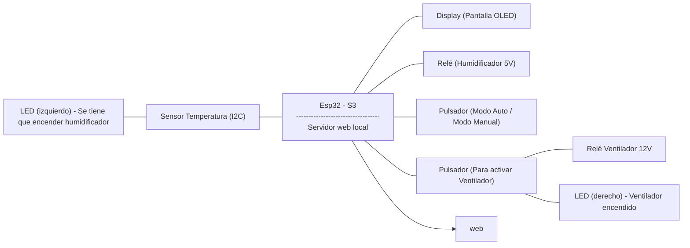

PROYECTO: VENTILADOR Y HUMIDIFICADOR

1.COMPONENTES:
Los componentes que constituyen este proyecto son:
1. ESP32-s3: 
2. Ventilador:
3. Sensor AHT10:
4. Pantalla OLED:
5. Relé:
6. Himudificador:
7. 

2. Presupuesto:
3. Diagrama de bloques:



4. Montaje:
5. Funcionalidades:
6. Conclusiones:

Codigo main.cpp:
```


```
