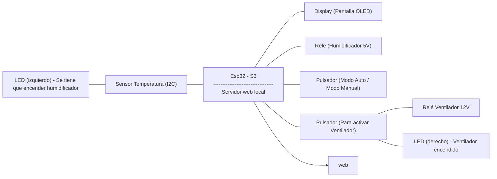

# PROYECTO: VENTILADOR Y HUMIDIFICADOR

## 1.COMPONENTES:
Los componentes que constituyen este proyecto son:
#### 1. ESP32-s3: 
Es el componente principal, el cual se encarga de dirigir al resto de componentes para que cada uno realice su respectiva función en su debido momento para que el conjunto desempeñe el objetivo final de este proyecto de manera adecuada y sincronizada.

#### 2. Ventilador:
Este dispositivo es uno de los dos componentes más importantes del proyecto. Funciona a 12V. La ESP32-S3 lo controla mediante un relé. 

#### 3. Sensor AHT10:
Este dispositivo comunicado mediante un bus I2C se encarga de medir tanto la temperatura como la humedad del ambiente.

#### 4. Pantalla OLED:
El objetivo de este dispositivo comunicado mediante un bus I2C es dar información al usuario sobre la temperatura, humedad, modo de utilización actual y más cosas relacionadas como el estado del ventilador.

#### 5. Relé:
El relé se encarga de que la ESP32-S3 pueda interactuar con el ventilador. Sin este dispositivo, nuestro microprocesador no podría dar el voltaje suficiente para que este último funcione correctamente ya que como máximo puede dar 5V y el ventilador necesita 12V. El objetivo del relé es alimentar al ventilador, solo cuando el microcontrolador ESP32-S3 lo determine, cortando y dejando pasar así esos 12V introducidos en el mismo relé, que a su vez está alimentado externamente a 5V.

#### 6. Humidificador:
Este dispositivo está alimentado a 5V de manera externa y se coloca en un recipiente con agua para que en caso de que la humedad del ambiente sea baja, humedezca y aumente ese porcentaje.

#### 7. LED's:
Estos dos componentes són complementarios al proyecto y se activan en momentos donde las condiciones de este són ideales.

#### 8. Pulsadores:
En este proyecto contamos con dos pulsadores como "Inputs" de entrada que nos sirven para interactuar con las diferentes salidas o modos de empleo.

#### 9. Cables:
Estos componentes són los más cruciales para garantizar que todos los dispositivos y otros componentes están conectados a la ESP32-S3 y por lo tanto pueda controlarlos correctamente.


## 2. Presupuesto:
## 3. Diagrama de bloques:



## 4. Montaje:
## 5. Funcionalidades:
## 6. Conclusiones:

Codigo main.cpp:
```
#include <WiFi.h>
#include <WebServer.h>
#include <Wire.h>
#include <Adafruit_SSD1306.h>
#include <Adafruit_AHTX0.h>

// Config WiFi
const char* ssid = "OPPOA94";
const char* password = "u58kkqpz";

// Pines
#define RELAY1_PIN 10
#define BUTTON1_PIN 18     // Botón manual ventilador
#define BUTTON2_PIN 15     // Botón modo auto/manual
#define LED1_PIN 12
#define LED2_PIN 11
#define UMBRAL_HUMEDAD 50.0

// OLED
Adafruit_SSD1306 display(128, 64, &Wire, -1);

// Sensor AHT10 I2C secundario
TwoWire I2C_Sensor = TwoWire(1);
Adafruit_AHTX0 aht;

// Estado
bool ventiladorActivo = false;
bool modoAutomatico = false;
bool pulsacion1Procesada = false;
bool pulsacion2Procesada = false;
bool estadoAutomaticoVentilador = false;

// Webserver
WebServer server(80);

// Variables para enviar al cliente
float temperaturaGlobal = 0.0;
float humedadGlobal = 0.0;
String estadoHumidificadorGlobal = "";
bool ventiladorGlobal = false;
bool modoAutomaticoGlobal = false;

void handleRoot() {
  String html = R"rawliteral(
    <!DOCTYPE html>
    <html>
    <head>
      <title>Control Ventilador y Humidificador</title>
      <style>
        body { font-family: Arial; margin: 20px; background: #f0f0f0; }
        .status { margin-top: 10px; }
        button { padding:10px 20px; font-size:16px; margin:5px; }
        canvas { background: white; border: 1px solid #ccc; margin-top:10px; }
      </style>
    </head>
    <body>
      <h2>Estado Sistema</h2>
      <p>Temperatura: <span id="temp">--</span> °C</p>
      <p>Humedad: <span id="hum">--</span> %</p>
      <p>Ventilador: <span id="vent">--</span></p>
      <p>Modo: <span id="modo">--</span></p>
      <p>Humidificador: <span id="humstate">--</span></p>
      <button id="toggleModo">Cambiar Modo</button>
      <button id="toggleVent" style="display:none;">Encender/Apagar Ventilador</button>

      <canvas id="chartTemp" width="400" height="150"></canvas>
      <canvas id="chartHum" width="400" height="150"></canvas>

      <script src="https://cdn.jsdelivr.net/npm/chart.js"></script>
      <script>
        const tempEl = document.getElementById('temp');
        const humEl = document.getElementById('hum');
        const ventEl = document.getElementById('vent');
        const modoEl = document.getElementById('modo');
        const humStateEl = document.getElementById('humstate');
        const toggleModoBtn = document.getElementById('toggleModo');
        const toggleVentBtn = document.getElementById('toggleVent');

        toggleModoBtn.onclick = () => {
          fetch('/toggleModo').then(updateStatus);
        };

        toggleVentBtn.onclick = () => {
          fetch('/toggleVent').then(updateStatus);
        };

        let tempChart, humChart;
        let tempData = [];
        let humData = [];
        let labels = [];

        function setupCharts() {
          const ctxTemp = document.getElementById('chartTemp').getContext('2d');
          const ctxHum = document.getElementById('chartHum').getContext('2d');

          tempChart = new Chart(ctxTemp, {
            type: 'line',
            data: {
              labels: labels,
              datasets: [{
                label: 'Temperatura (°C)',
                data: tempData,
                borderColor: 'red',
                fill: false,
              }]
            },
            options: {
              animation: false,
              scales: { y: { min: 0, max: 50 } }
            }
          });

          humChart = new Chart(ctxHum, {
            type: 'line',
            data: {
              labels: labels,
              datasets: [{
                label: 'Humedad (%)',
                data: humData,
                borderColor: 'blue',
                fill: false,
              }]
            },
            options: {
              animation: false,
              scales: { y: { min: 0, max: 100 } }
            }
          });
        }

        function updateStatus() {
          fetch('/status')
            .then(response => response.json())
            .then(data => {
              tempEl.textContent = data.temperatura.toFixed(1);
              humEl.textContent = data.humedad.toFixed(1);
              ventEl.textContent = data.ventilador ? 'ENCENDIDO' : 'APAGADO';
              modoEl.textContent = data.modoAutomatico ? 'AUTOMATICO' : 'MANUAL';
              humStateEl.textContent = data.estadoHumidificador;

              if (data.modoAutomatico) {
                toggleVentBtn.style.display = 'none';
              } else {
                toggleVentBtn.style.display = 'inline-block';
              }

              // Actualizar arrays para graficos
              const now = new Date();
              const label = now.getHours() + ":" + now.getMinutes() + ":" + now.getSeconds();
              labels.push(label);
              if (labels.length > 30) labels.shift();

              tempData.push(data.temperatura);
              if (tempData.length > 30) tempData.shift();

              humData.push(data.humedad);
              if (humData.length > 30) humData.shift();

              tempChart.update();
              humChart.update();
            });
        }

        window.onload = () => {
          setupCharts();
          updateStatus();
          setInterval(updateStatus, 2000);
        };
      </script>
    </body>
    </html>
  )rawliteral";

  server.send(200, "text/html", html);
}

void handleStatus() {
  String json = "{";
  json += "\"temperatura\":" + String(temperaturaGlobal, 1) + ",";
  json += "\"humedad\":" + String(humedadGlobal, 1) + ",";
  json += "\"ventilador\":" + String(ventiladorGlobal ? "true" : "false") + ",";
  json += "\"modoAutomatico\":" + String(modoAutomaticoGlobal ? "true" : "false") + ",";
  json += "\"estadoHumidificador\":\"" + estadoHumidificadorGlobal + "\"";
  json += "}";

  server.send(200, "application/json", json);
}

void handleToggleModo() {
  modoAutomatico = !modoAutomatico;
  server.send(200, "text/plain", "OK");
}

void handleToggleVent() {
  if (!modoAutomatico) {
    ventiladorActivo = !ventiladorActivo;
  }
  server.send(200, "text/plain", "OK");
}

void setup() {
  Serial.begin(115200);
  delay(100);

  pinMode(BUTTON1_PIN, INPUT_PULLUP);
  pinMode(BUTTON2_PIN, INPUT_PULLUP);
  pinMode(RELAY1_PIN, OUTPUT);
  pinMode(LED1_PIN, OUTPUT);
  pinMode(LED2_PIN, OUTPUT);

  digitalWrite(RELAY1_PIN, LOW); // Relé apagado por defecto
  digitalWrite(LED2_PIN, LOW);

  Wire.begin(8, 9);

  if (!display.begin(SSD1306_SWITCHCAPVCC, 0x3C)) {
    Serial.println("Error inicializando pantalla OLED");
  }
  display.clearDisplay();
  display.setTextSize(1);
  display.setTextColor(SSD1306_WHITE);
  display.display();

  I2C_Sensor.begin(16, 17);
  if (!aht.begin(&I2C_Sensor)) {
    Serial.println("Error inicializando sensor AHT10");
  } else {
    Serial.println("Sensor AHT10 listo.");
  }

  // Conectar WiFi
  WiFi.begin(ssid, password);
  Serial.print("Conectando a WiFi");
  while (WiFi.status() != WL_CONNECTED) {
    delay(500);
    Serial.print(".");
  }
  Serial.println();
  Serial.print("WiFi conectado, IP: ");
  Serial.println(WiFi.localIP());

  // Mostrar IP en OLED
  display.clearDisplay();
  display.setCursor(0, 0);
  display.println("WiFi Conectado");
  display.print("IP: ");
  display.println(WiFi.localIP());
  display.display();
  delay(2000);

  // Configurar servidor web
  server.on("/", handleRoot);
  server.on("/status", handleStatus);
  server.on("/toggleModo", handleToggleModo);
  server.on("/toggleVent", handleToggleVent);
  server.begin();
  Serial.println("Servidor web iniciado");
}

void loop() {
  // Leer botones
  bool boton1Presionado = digitalRead(BUTTON1_PIN) == LOW;
  bool boton2Presionado = digitalRead(BUTTON2_PIN) == LOW;

  // Alternar modo automático/manual
  if (boton2Presionado && !pulsacion2Procesada) {
    modoAutomatico = !modoAutomatico;
    pulsacion2Procesada = true;
  } else if (!boton2Presionado) {
    pulsacion2Procesada = false;
  }

  // Control manual solo si estamos en modo manual
  if (!modoAutomatico) {
    if (boton1Presionado && !pulsacion1Procesada) {
      ventiladorActivo = !ventiladorActivo;
      pulsacion1Procesada = true;
    } else if (!boton1Presionado) {
      pulsacion1Procesada = false;
    }
  }

  // Leer sensor
  sensors_event_t humidity, temp;
  aht.getEvent(&humidity, &temp);

  float hum = humidity.relative_humidity;
  float temperatura = temp.temperature;

  // Decidir estado del humidificador y LED2
  if (hum < UMBRAL_HUMEDAD - 2) {
    estadoHumidificadorGlobal = "Encender humidificador";
    digitalWrite(LED2_PIN, LOW);
  } else if (hum > UMBRAL_HUMEDAD + 2) {
    estadoHumidificadorGlobal = "Apagar humidificador";
    digitalWrite(LED2_PIN, LOW);
  } else {
    estadoHumidificadorGlobal = "Humedad optima";
    digitalWrite(LED2_PIN, HIGH);
  }

  // Control automático ventilador
  if (modoAutomatico) {
    if (temperatura >= 30.0) {
      estadoAutomaticoVentilador = true;
    } else if (temperatura <= 28.0) {
      estadoAutomaticoVentilador = false;
    }
    ventiladorActivo = estadoAutomaticoVentilador;
  }

  // Actualizar relay y LED1
  digitalWrite(RELAY1_PIN, ventiladorActivo ? LOW : HIGH);
  digitalWrite(LED1_PIN, ventiladorActivo);

  // Guardar variables globales para web
  temperaturaGlobal = temperatura;
  humedadGlobal = hum;
  ventiladorGlobal = ventiladorActivo;
  modoAutomaticoGlobal = modoAutomatico;

  // Mostrar en OLED
  display.clearDisplay();
  display.setCursor(0, 0);
  display.print(modoAutomatico ? "Modo: AUTO" : "Modo: MANUAL");
  display.setCursor(0, 10);
  display.print("Vent: ");
  display.println(ventiladorActivo ? "ON" : "OFF");

  display.print("Temp: ");
  display.print(temperatura);
  display.println(" C");

  display.print("Hum: ");
  display.print(hum);
  display.println(" %");

  display.println(estadoHumidificadorGlobal);
  display.display();

  // Mostrar en Serial
  Serial.println("=== ESTADO DEL SISTEMA ===");
  Serial.print("Temperatura: ");
  Serial.print(temperatura);
  Serial.println(" °C");

  Serial.print("Humedad: ");
  Serial.print(hum);
  Serial.println(" %");

  Serial.print("Modo: ");
  Serial.println(modoAutomatico ? "AUTOMATICO" : "MANUAL");

  Serial.print("Ventilador: ");
  Serial.println(ventiladorActivo ? "ENCENDIDO" : "APAGADO");

  Serial.print("Humidificador: ");
  Serial.println(estadoHumidificadorGlobal);
  Serial.println();

  server.handleClient();

  delay(1000);
}


```
